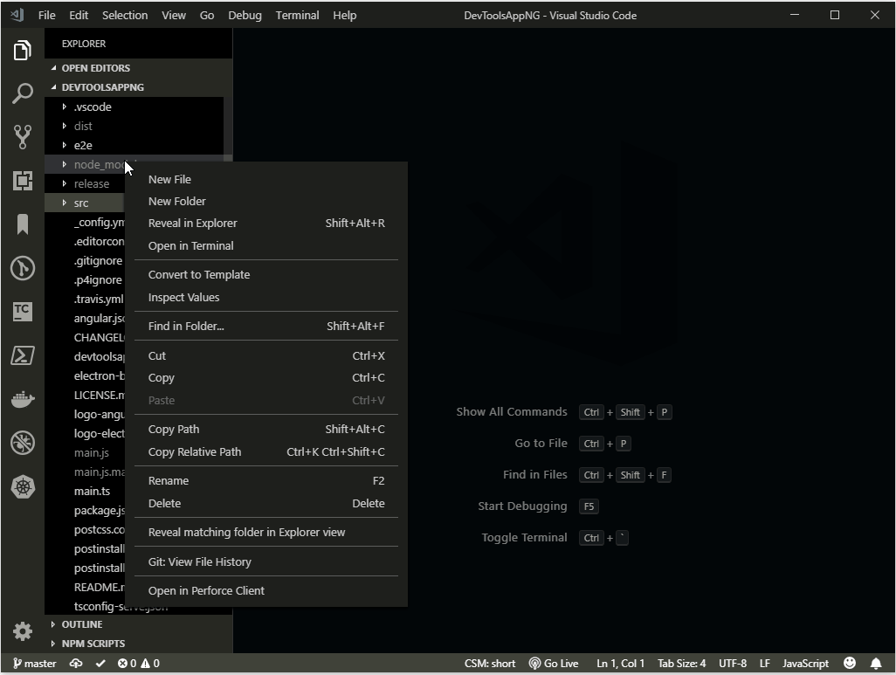

# revealfolder README

An extension to reveal a matching folder in Explorer.

## Features

It supports the following explorer context menu commands:

- `Go to Folder...`

Similar ro VSCode's `Go to File...` command.

Prompts for part of folder name, then searches for matching folders under the context folder and then reveal the folder in Explorer view. If there is no context folder workspace root is assumed. This may not perform well if you have lots of files in project e.g. node_modules folder.

The command caches the folder's subfolder. Use the following command to clear the cache.

- `Clear Go To Folder Cache`

to clear the cache. After this newly added folders will be found.



The name matching is case insensitive on Windows and case sensitive on other platforms.

Shows progress bar while the find is in progress. The processed folders are cached.

Supports boolean configuration ```Match like Quick open strategy```. If set to ```true``` the matching is done like ```Quick Open```. If set to ```false``` the matching is done by checking if the folder name contains the ```match`` text.

## Known Issues

No known issues.

## Release Notes

### 1.0.18

